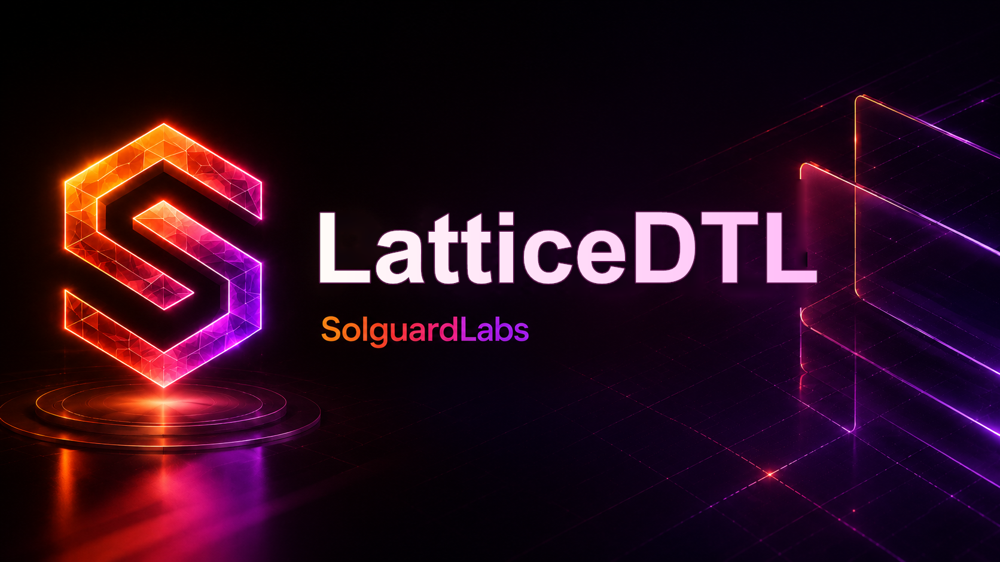

# LatticeDTL



LatticeDTL modela una infraestructura DTL de netting para multiples activos,
cuentas operativas y dominios de liquidez. El proyecto esta escrito en C y
expone una CLI de escenarios que emite reportes JSON deterministas para que
herramientas externas puedan validar el estado final de cada epoch.

El laboratorio esta pensado como un motor de liquidacion autocontenido. No
requiere nodos externos, bases de datos, claves reales ni servicios remotos: los
fixtures de activos, cuentas, vaults y deudas se generan localmente.

## Componentes

- `asset_registry`: catalogo de activos, dominios, precision, clases de riesgo
  y parametros de vault.
- `ledger`: cuentas, balances por activo, reservas de vault, liabilities,
  transferencias atomicas y eventos de auditoria.
- `matrix`: matriz de obligaciones entre cuentas, reduccion de filas,
  compactacion de microposiciones y materializacion de celdas liquidables.
- `epoch_netting`: cierre de epoch, prechecks de debito, aplicacion de
  transferencias y resumen de volumen por activo.
- `withdrawals`: solicitudes de retirada, validacion de liquidez disponible y
  decremento sincronizado de balance y reserva.
- `reconciliation`: resumen por activo de balances agregados, reserve,
  liability, gaps y celdas activas.
- `policy`: reglas por clase de riesgo, exposicion operacional por cuenta y
  prechecks de retirada.
- `runtime`: fixtures deterministas y escenarios CLI.

## Flujo de Epoch

1. Se registra el catalogo de activos y dominios de liquidez.
2. Se crean cuentas de sistema, market makers, bridges y clientes.
3. Se depositan balances de genesis y participantes.
4. La matriz recibe obligaciones pendientes entre deudor, acreedor, activo y
   dominio.
5. El motor reduce filas compatibles antes de materializar celdas de
   liquidacion.
6. El epoch ejecuta un precheck agregado por cuenta y activo.
7. Las transferencias se aplican al ledger.
8. Las retiradas posteriores consumen balance disponible y reserva de vault.
9. El reporte JSON devuelve digests, balances, vaults, matriz y withdrawals.

## Escenarios CLI

Compilar:

```bash
node scripts/build.mjs
```

Ejecutar escenario por defecto:

```bash
./build/lattice-dtl
```

Escenarios disponibles:

```bash
./build/lattice-dtl baseline
./build/lattice-dtl compact
./build/lattice-dtl domains
./build/lattice-dtl withdrawal
./build/lattice-dtl batch
./build/lattice-dtl snapshot
./build/lattice-dtl policy
```

En Windows, el helper de build intenta usar `cc`, `gcc`, `clang`, `cl` o WSL
con `gcc`, en ese orden.

## Comandos

Build:

```bash
npm run build
```

Tests Node contra la CLI:

```bash
npm test
```

Suite local:

```bash
npm run test:all
```

CI local con Bash:

```bash
bash scripts/ci.sh
```

Build con Make:

```bash
make
make test
```

## Salida JSON

Cada escenario devuelve un documento con:

- metadata del laboratorio y escenario;
- activos registrados;
- cuentas operativas;
- balances no nulos;
- reservas y liabilities de vault;
- estadisticas de matriz;
- resumen de epoch;
- withdrawals ejecutadas o rechazadas;
- reconciliacion por activo;
- reporte de policy por cuenta;
- digests deterministas de registry, matrix y ledger.

Los importes se expresan en unidades minimas del activo. Por ejemplo, `USDC`
usa 6 decimales, por lo que `15000000` representa 15 unidades completas.

## Pruebas

La suite publica valida:

- netting multi-activo de un epoch normal;
- compactacion de microposiciones del mismo activo;
- separacion de posiciones grandes por activo;
- retirada directa desde vault;
- flujo batch con netting y retirada posterior;
- policy exposure y rechazo normal de una retirada fuera de limite;
- presencia de metadata y estructura esperada.

Las pruebas estan en `tests/node` y usan `node:test`. El helper compartido
compila el binario antes de ejecutar escenarios.

## Documentacion Adicional

La guia [docs/architecture.md](docs/architecture.md) resume entidades,
pipeline, escenarios, convenciones de importes e invariantes publicos para una
revision de auditoria.

## Requisitos

- Node.js `20` o superior.
- Un compilador C compatible con C11 (`cc`, `gcc`, `clang`, MSVC `cl` o WSL con
  `gcc`).
- Bash para `scripts/*.sh` y CI local.

## Estado del Proyecto

LatticeDTL es un laboratorio tecnico autocontenido. La implementacion busca
parecer un motor DTL revisable: el codigo esta dividido por dominio, la CLI es
determinista, la suite publica cubre rutas normales y la configuracion de CI
esta incluida en el repositorio.
